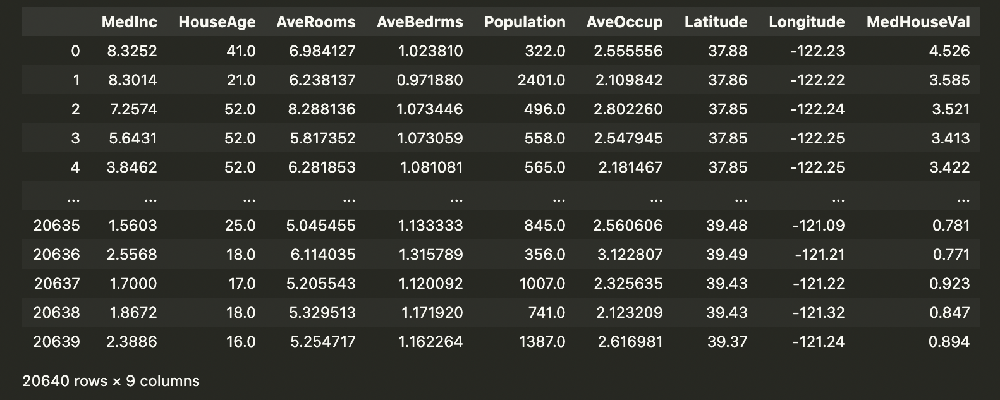

# SBCS Data Science Hackathon, Competition One (Regression)

## Table of Contents
1. [Introduction](#introduction)
    - [Schedule](#schedule)
    - [Side Tasks](#side-tasks)
1. [Background](#background)
    - [Programming Languages](#programming-languages)
    - [The Data Set](#the-data-set)
    - [Getting Started](#getting-started)
1. [Data Science Process](#data-science-process)
1. [Main Task](#main-task)
    - [Splitting the Data](#splitting-the-data)
    - [Baseline Model](#baseline-model)
    - [Benchmarking Your Models](#benchmarking-your-models)
    - [Submitting Your Work](#submitting-your-work)
1. [Data Visualization Side Task](#data-visualization-side-task)
1. [Tips for Success](#tips-for-success)
    - [Missing Data](#missing-data)
    - [Skewed Data Distribution](#skewed-data-distribution)
    - [Outliers](#outliers)
    - [Duplicate Data](#duplicate-data)


## Introduction

Welcome to Stony Brook Computing Society's Spring 2022 Data Science Hackathon! Over the course of the month, you'll have the opportunity to participate in four different projects, each of which focuses on a different aspect of data science. 

## Details

### Schedule

The hackathon starts at 12 PM EDT on April 1st, and it ends at 12 PM EDT on April 30th. As mentioned above, there will be a total of four competitions to participate in:

1. Regression (7 days long): Starts at 12 PM EDT on April 1st and ends at 12 PM EDT on April 8th.
1. Simple Classification (7 days long) : Starts at approximately 12:05 PM EDT on April 8th and ends at 12 PM EDT on April 15th. 
1. Sentiment Analysis (7 days long) : Starts at approximately 12:05 PM EDT on April 15th and ends at 12 PM EDT on April 22nd.
1. Image Classification (8 days long) : Starts at approximately 12:05 PM EDT and ends at 12 PM EDT on April 30th.

### Side Tasks

In addition to the main model-building task, each competition will also include a data visualization side task. For each competition, the main and side tasks are independent of each other. Because of this, you have the option to participate only in the main task, only in the side task, or in both the main and side tasks. 

## Background 

The first competition is focused on regression. Regression is the process of finding the mathematical model which represents a set of data while minimizing its error, or deviation from the actual data. Generally, it is a very good way of learning and coming to understand the relationships between the attributes of a data set.

### Programming Languages

There are a few different programming languages used in data science. The most common are Python and R: my understanding is that Python is more widely used among tech professionals, while R is especially popular among statisticians and other academics. There are other programming languages for data science projects, such as SAS, STATA, and SPSS, however Python and R dominate the industry. For the SBCS Spring 2022 Data Science Hackathon, **all** competitions expect you to use Python, as R requires a much more direct involvement in model creation and therefore a more solid mathematical background, and none of us on the e-board have experience with SAS, STATA, SPSS, or other non-Python or R data science languages (that I know of).  

### The Data Set

The data set you'll be using in this competition is included as part of the scikit-learn Python package. (For this reason, it may be easier for you to use Python for this competition instead of R, as you'll be using Python to obtain the data set anyway.) Specifically, you'll be using the California Housing data set, which includes 8 predictive, numeric attributes - MedInc, HouseAge, AveRooms, AveBedrms, Population, AveOccup, Latitude, Longitude - and 1 target/dependent variable - MedHouseVal. See the official documentation [here](https://scikit-learn.org/stable/datasets/real_world.html#california-housing-dataset) for more information.

### Getting Started

The first thing you'll need to do (if you haven't already) is install the language of your choice (Python preferred, but R is acceptable as well) on your computer. If you want to use Python, download the installer files that match your computer's specs for the latest version [here](https://www.python.org/downloads/release/python-3104/), and then use the downloaded program to install it (we suggest using the installer programs over the other installation methods for the sake of time and energy... both yours and ours).

We also suggest using a third-party development environment like PyCharm Professional **(public service announcement: students can get PyCharm Professional, IntelliJ IDEA Professional, and many other premium JetBrains solutions for FREE... more information [here](https://www.jetbrains.com/community/education/#students))** or Visual Studio Code. 

After installing Python (or R) and (hopefully) a third-party development environment, you'll need to go to your computer's command line and execute the following command: 
```
> pip install scikit-learn
```

This command will install the scikit-learn Python package onto your computer. Note: if this command doesn't work, then try

```
> python -m pip install scikit-learn
```

If that doesn't work, enter the following command:

```
> pip --version
```

If this doesn't return a version number, then you may not have pip installed on your computer. In this case, I'd suggest downloading [anaconda](https://www.anaconda.com), since it comes with many of the important data science tools you may need as well as a build of the Python programming language (anaconda is very common in data science, so I might consider using it anyway, however I'll leave this decision up to you).

Next, opne your development environment, create a new Jupyter notebook file (using the .ipynb file extension) and enter

```
from sklearn import datasets
import pandas as pd
```

in the first code cell in your Jupyter notebook (.ipynb file) and then

```
data = datasets.fetch_california_housing(as_frame=True).frame
```

Next, create another code cell below it and enter the following:

```
data
```

Run all the cells **in order**, and you should get something that looks like the following image after executing the third cell:



Note: your output might not look exactly like mine, depending on which development environment you're using (I'm using Visual Studio Code).

Once you've done this, you're ready to start!

## Data Science Process

Every data science project should follow a process similar to that described below:
1. Data Collection.
1. Data Cleaning.
1. Exploratory Data Analysis (EDA).
1. Model Building.
1. Model Deployment.

Source: [towardsdatascience.com](https://towardsdatascience.com/the-data-science-process-a19eb7ebc41b)

In this project, step 1. is basically done for you; all you need to do is install the scikit-learn Python package and import the data.

Step 2. involves attempting to scrub the data of any existing blemishes which may cause the knowledge obtained from the data set to be more inaccurate than would be optimal for the creation of a working model. These blemishes can vary in type from one project to the next, depending on the nature of the project itself. In my experience, some of the most common types of bemishes that can be found in a regression project's data set are missing data, variables with skewed data distributions (for example, a heavy skew is common in income data, so that the majority of observations are on the left side of the distribution while abnormally high income observations create a long "tail" on the right side of the distribution), observations with suspiciously large or small values (we call these outliers), and even duplicated data records (this describes a row of data that is exactly the same as another row in the same data set). Note: you can find out how to deal with each of these blemishes in the [Tips for Success](#tips-for-success) section.

Step 3. is called Exploratory Data Analysis, or EDA, because it is the stage in the data science life cycle where you use different tools and techniques to try and learn more about the relationships present in the data set. This usually involves the creation of plots and diagrams: histograms, boxplots/violinplots, scatterplots, line plots/time series plots, et cetera. Note: if you'd prefer **not** to create a model, you can still participate in the [Data Visualization Side Task](#data-visualization-side-task), meaning you could stop after this step and submit some of your best data visualizations for scoring. Otherwise, you should continue reading.

Step 4. involves using various mathematical algorithms to create models which attempt to describe the data set and the relatonships it contains. Generally, it's good practice to start off by creating a baseline model. A baseline model is conventionally a very simple model that is used as a starting place for further modelling and optimization. Your goal should always be to try and beat the performance of the baseline model; the model that beats the baseline by the greatest amount should be your accepted model, or the model that you accept as the best description of your data. However, if you cannot find any model that does so, it is possible that the baseline model is the best representation of your data set, and therefore it would be your accepted model. For more specific information about how you'll should be applying the baseline model, see the [Main Task](#main-task) section.

Step 5. doesn't really apply to us here, however I guess you can think of submitting your Jupyter notebook (.ipynb file) source code as "deploying" your model if you'd like. 

## Main Task

The main task for each competition involves each of the 5 steps of the data science life cycle, as described in the [Data Science Process](#data-science-process) section: you'll be
1. Collection the data (using the scikit-learn Python package, as presented in the [Getting Started](#getting-started) section).
1. Cleaning the data (see the [Tips for Success](#tips-for-success) section for some pointers on how to deal with common blemishes in data for regression projects).
1. Exploring the data and analyzing what you find to better understand the relationships between the variables in the data set (the EDA phase).
1. Creating models that attempt to describe the relationships between the target/dependent variable and the explanatory/independent variables (a baseline model, plus additional models that attempt to beat the baseline).
1. Deploying your accepted model (the model you determine to describe the data set the best) by submitting your source code and specifying which model you have accepted.

### Splitting the Data

In most data science projects, it's convention to split the data set you're using into a "training" set and a "testing" set. The training set is used to optimize the default model so that it better fits the data. Think of the following scenario as a sort of (very strange) analogy to the use of a training set to fine-tune a machine learning model:

An explorer wants to unlock an ancient vault, however the vault has a sort of protective lock on it. The keyhole is shaped like a triangle, however the explorer only has a square block and a whittling knife. If the explorer wants to open the vault, they must carve the square block into a triangle so that it fits into the keyhole. So, they get to work, using their whittling knife to carve the square block, trying every so often to fit the carved block into the key hole. Eventually, the explorer perfects the carving, and when they place the now-triangular block into the keyhole, the vault opens. 

As mentioned before, this scenario is very strange, however I believe it is a very good analogy to why we need a training set as well as how the training set whittles the model (like the block was whittled) so that it best fits the data (like the carved block fit in the keyhole). 

While this scenario is a good example, it does have a catch: you do **NOT** want to fit the model to the training too well, as it will perform very poorly on the testing data. Think of it like buying a tuxedo or a tailored dress: the clothing is tailored to your own figure, so it should fit you very well, however if someone with a very different figure than your own attempts to wear it, it will fit them very poorly. This problem is called **overfitting**. 

Training a model is a balancing act: the model should be fitted to the training set well enough that it does well on the training set, but not **too** well so that it flounders when used on the testing set. In other words, you want to use the training set to create a model that can be generalized to a similarly-structured data set with different observations without any great loss in performance.

To split the data set, you can use the "train_test_split" function from the scikit-learn Python package. Generally, the size of your training set should be at least 65% or 70% of the original data set, however as the size of the data set increases, you can increase the proportion of the data set used in training and decrease the proportion of the data set used in testing without any great cost to model performance. 

### Baseline Model

As mentioned in the [Data Science Process](#data-science-process) section, you should always start the model creation phase by building a baseline model.

For the sake of standardizing the scoring process, you **must** use the baseline model provided in the [Task 1 Sample](src/task-one-sample.ipynb), including it in your own Jupyter notebook (.ipynb file) source code.

### Benchmarking Your Models

One of the most common benchmarks used to evaluate the performance of a regression model is the model's adjusted- score. Unfortunately, you'll need to calculate the adjusted- yourself using the NumPy Python package. 

First, make sure you import "metrics" from the scikit-learn Python package; the cell where you import all the packages you'll be using should include the following line (you can add to it by importing more from the scikit-learn package, but at the **very least** you will need the following imported):

```
from sklearn import datasets, model_selection, metrics
```

where "datasets" contains the data set you'll need for the competition, "model_selection" includes the "train_test_split" function for splitting the data, and "metrics" includes the "r2_score" function you'll be using to determine the non-adjusted  score of the model.

Next, you need to use the explanatory/independent variables data to predict the target/dependent variable's values using your model. As can be seen in the [Task 1 Sample](src/task-one-sample.ipynb), predictions are made from a classical linear regression model using

```
y_pred = model.predict(X_test)
```

where  is the output predictions for the values of  and  is the testing data for the explanatory/independent variables. 

Then, you'll calculate the model's non-adjusted  score as follows:

```
r2 = metrics.r2_score(y_test, y_pred)
```

At this point, you need to determine the number of observations in the testing set and the number of explanatory/independent variables being used in the model. This can be done using

```
n, k = X_test.shape
```

Finally, you need to calculate the adjusted- score of your model's performance on the testing set:

```
adj_r2 = 1 - (1 - r2) * ((n - 1) / (n - k - 1))
```

The value stored in the "adj_r2" variable is the adjusted- score you'll need to report as part of your submission. 

It's important that you understand that the adjusted- score includes a cost for every additional variable you include in your model. Therefore, it is in your best interest to carefully determine whether or not each model you include has a positive effect on the value of the adjusted- score.

Note: any time you redefine the model, i.e., add or remove explanatory/independent variables, you **must** re-run the cell in your Jupyter notebook where you define the model you're using, and **all** the cells after it. If you don't, the model will **not** update automatically, as each cell is executed independently of those which come after it.

### Submitting Your Work

For your work to be considered in the competition one scoring, you must submit it using [this](https://forms.gle/arfM1TEoj2eXkQZb7) Google form. Your submission **must** include the following components
  - Any source code files pertaining to the main task.
  - A self-reported adjusted- score (see the [Benchmarking Your Models](#benchmarking-your-models) section for more information on how to do this).
  - A self-reported number of observations in your **testing set** (variable  in the code displayed in the [Benchmarking Your Models](#benchmarking-your-models) section.).
  - A self-reported number of explanatory/independent variables used in your model (variable  in the code displayed in the [Benchmarking Your Models](#benchmarking-your-models) section).

Please note: because we don't know how many people will be participating at this point in time, we are requiring that each participant self-report their adjusted- score in the event that a lot of people submit and we don't have time to inspect everyone's code. However, if we do have enough time to inspect everyone's code and it is determined that your self-reported adjusted- score is higher than what is returned when we run your code by an amount which implies intentional misreporting, **you will be disqualified from the first competition!!!** On a lighter note, if we determine that your self-reported adjusted- is smaller than your code indicates when we run it, we will use the actual (larger) score instead of the self-reported (smaller) score.

## Data Visualization Side Task

If you decide to participate in the data visualization side task, then you'll need to create at least three data visualizations using available Python packages. Then, when you're ready to submit, use [this](https://forms.gle/2Ycj5Qv7M1c5t4rf7) Google form to upload the image files for your three **best** visualizations.

Remember: the data visualization side task is scored independently of the main task, so you can choose to participate in one or the other, or even both. 

## Tips for Success

As mentioned in the [Data Science Process](#data-science-process) section, there are a few common types of blemishes that can be found in a regression project's data set.

### Missing Data

Rows in the data set that have missing (null or NA) values can be dealt with in one of two ways, for the sake of simplicity:
1. If the number of rows with missing data values is relatively small compared to the size of the data set as a whole, then you can simply drop the rows with missing data (the "dropna" function from the pandas Python package is very useful here, just remember to use the "reset_index" function afterwards, making sure to drop the old series of indices in the process).
1. If the number of rows with missing data values is not relatively small enough to be dropped, then you can impute, or guess, the missing data. It's common that missing data be imputed using the mean or the median of the rest of the data for that variable (the data that is not missing). Just note: the mean is much more prone to being skewed by outliers in the data than the mean is, so choose your method of imputation based on the nature of the variable and its distribution.

### Skewed Data Distribution

A skewed data distribution can be a bit of an issue when creating a machine learning model. The best way to deal with a skewed distribution of data for a variable is to transform the variable using a mathematical function. For example, you can apply the natural logarithm to all the variable's data and use the transformed variable in the model instead of or in addition to the untransformed variable. This will hopefully normalize the variable's data distribution, making it appear more bell-shaped and less skewed to one side.

### Outliers

My understanding is that there is no specific criterion for determining if a data point is an outlier. Therefore, it's up to you to skim through the data set to try and find outliers, if there are any. If you do find outliers, you need to think about the nature of the variable it is present in; if such an outlier truly doesn't make sense based on the nature of the outlier, then the entire record (the row of the data set that contains the outlier) should be dropped, or removed.

### Duplicate Data

It's fairly simple to find and remove duplicate records in Python using the "drop_duplicates" function from the pandas package. Just make sure to reset the indices of the DataFrame, dropping the old index series in the process. 
